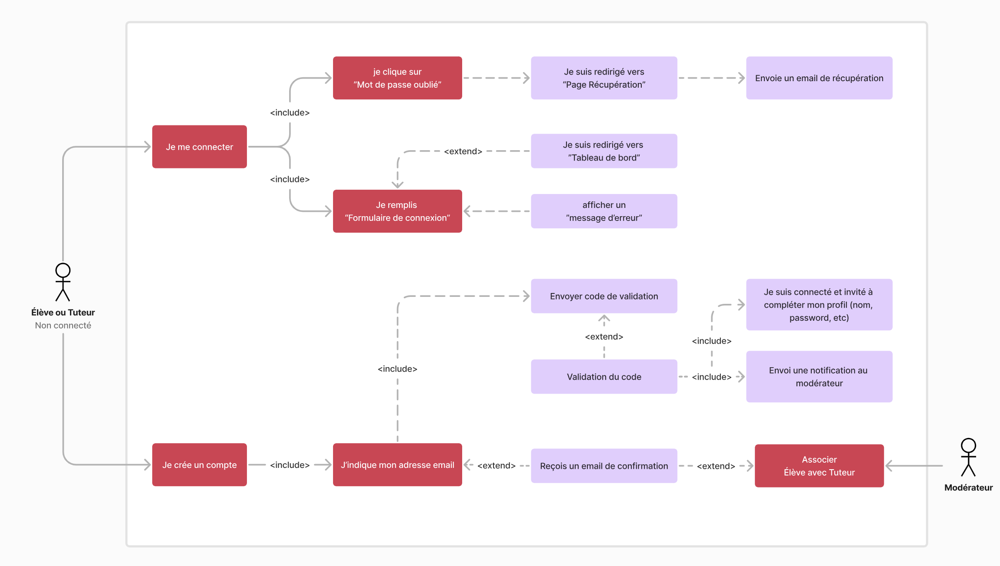
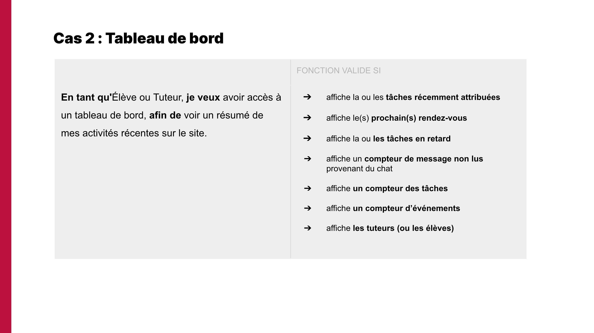
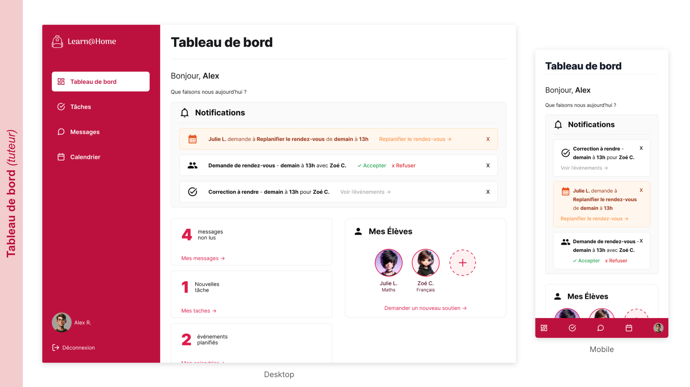
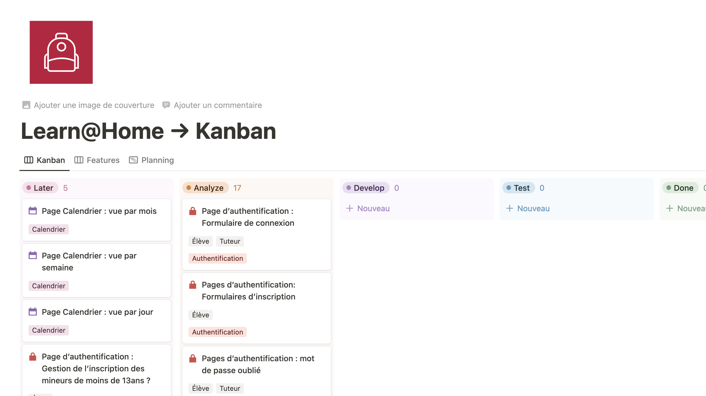

# Learn@Home

> Projet fictif de formation OpenClassrooms

## Problématique

Learn@Home est une association qui met en relation des enfants en difficulté scolaire et des bénévoles, en ligne. Ils ont pour objectif de permettre à tout élève, où qu’il soit, d’accéder à un soutien scolaire à distance.

Chaque élève inscrit sur le site a un tuteur bénévole, qui lui est assigné. Le bénévole a pour objectif de soutenir l’élève dans son apprentissage, à travers de courts rendez-vous prévus chaque semaine. Durant ces rendez-vous, le bénévole aide l’élève à réaliser ses devoirs et à s’organiser.

## Besoin

Pour faciliter les interactions et la communication, Learn@Home souhaite créer
un nouveau site web, qui doit être composé des pages suivantes :

1. Une page de **connexion**
2. Une page **tableau de bord**
3. Une page **interface de chat**
4. Une page de **calendrier**
5. Une page de **gestion des tâches**

## Compétences développées

✅ **Contribuer à un projet** en utilisant une méthodologie agile  
✅ **Identifier les besoins** de l'application à partir d'un cahier des charges  
✅ **Modéliser une solution technique** pour un client  
✅ **Créer une maquette** pour un client

## Livrables

### Les diagrammes de cas d’usage

Un diagramme de cas d'utilisation est une représentation visuelle des interactions entre les acteurs (utilisateurs) et le système. Il décrit les différentes actions que les acteurs peuvent effectuer et comment le système réagit à ces actions. Cela permet de comprendre les fonctionnalités du système et les scénarios d'utilisation.

[Voir les Use Cases](use-cases/Learn@Home-Uses-Cases.pdf)

### Les user stories avec critère(s) d’acceptation

Une user story est une description concise d'une fonctionnalité du point de vue de l'utilisateur final. Elle capture le but de l'utilisateur et la valeur qu'il attend en utilisant le système. Les user stories sont généralement écrites dans un format spécifique, tel que "En tant que [rôle de l'utilisateur], je veux [objectif] afin que [valeur]". Elles servent d'outil de communication entre l'équipe de développement et les parties prenantes, aidant à prioriser et planifier le développement des fonctionnalités du logiciel.

[Voir les User Stories](user-stories/Learn@Home-User-Story.pdf)

### Les maquettes du site

Les maquettes sont des représentations visuelles de l'interface utilisateur d'une application ou d'un site web. Elles permettent de visualiser et de présenter le design et la disposition des éléments de l'interface, tels que les boutons, les menus, les formulaires, etc. Les maquettes servent à communiquer et à valider le concept et l'apparence de l'application avant de passer à la phase de développement. Elles permettent également de recueillir les commentaires des utilisateurs et des parties prenantes pour améliorer l'expérience utilisateur.

[Voir les maquettes](wireframes/Learn@Home-Wireframes.pdf)

### Le tableau Kanban *(Notion, Trello, or GitHub)*

Le tableau Kanban est un outil de gestion de projet visuel qui permet de suivre et de gérer les tâches d'un projet de manière efficace. Il utilise des colonnes pour représenter les différentes étapes du flux de travail, telles que "À faire", "En cours" et "Terminé". Les tâches sont représentées par des cartes qui peuvent être déplacées d'une colonne à l'autre pour indiquer leur progression. Le tableau Kanban permet à l'équipe de visualiser rapidement l'état d'avancement du projet, d'identifier les goulots d'étranglement et de prioriser les tâches. Il favorise également la collaboration et la communication entre les membres de l'équipe.

[Voir le Kanban Notion](https://raphaelsanchez.notion.site/Learn-Home-Kanban-ddf3567eba034b6eb09e802e028cb983)
